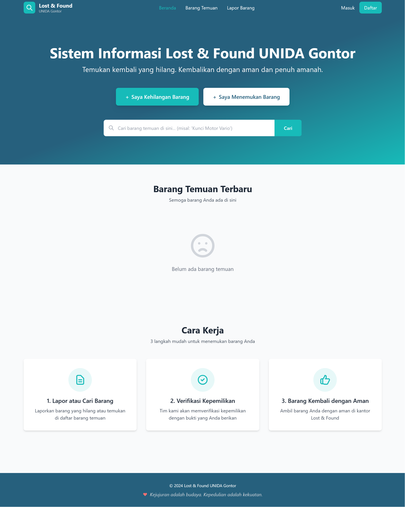
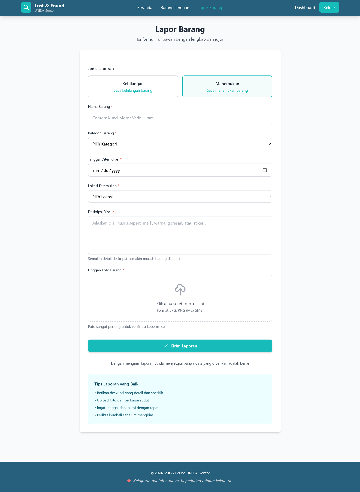
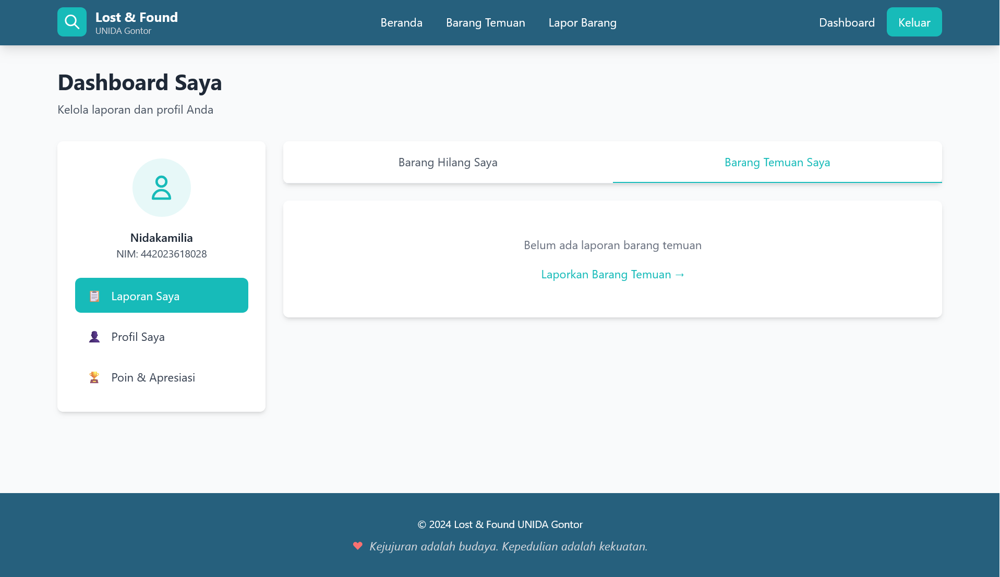

# Lost & Found Information System – UNIDA Gontor

A web-based Lost & Found Information System built with Laravel to help students and staff report, search, and manage lost or found items within the UNIDA Gontor campus.

---

## 📌 Features

- Report lost items
- Report found items
- Upload item photos
- Item categorization
- Location tracking
- User dashboard
- Item verification system
- Authentication (Login & Register)

---

## 🏠 Homepage



The homepage allows users to search for found items and quickly report lost or found items. It provides a clean and user-friendly interface for better user experience.

---

## 📝 Report Item Page



Users can submit detailed reports including:
- Item name
- Category
- Date
- Location
- Description
- Photo upload

This helps the admin verify ownership more effectively.

---

## 📊 User Dashboard



Each user has a personal dashboard where they can:
- View lost item reports
- View found item reports
- Manage their profile
- Track report status

---

## ⚙️ Technology Stack

- Laravel
- PHP
- MySQL
- Bootstrap / Tailwind (depending on your setup)
- XAMPP (Local Development)

---

## 🚀 Installation

```bash
git clone https://github.com/nidaintech/Lost-and-Found-UNIDA-GONTOR.git
cd Lost-and-Found-UNIDA-GONTOR
composer install
cp .env.example .env
php artisan key:generate
php artisan migrate
php artisan serve
